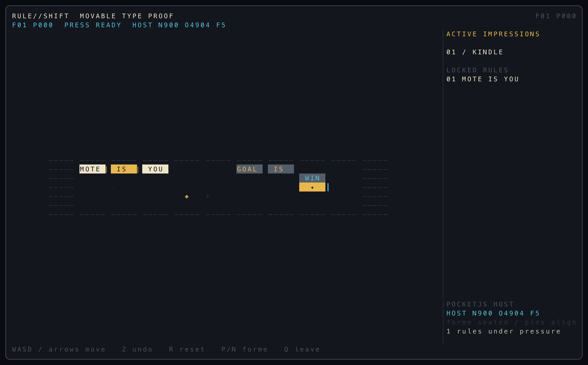
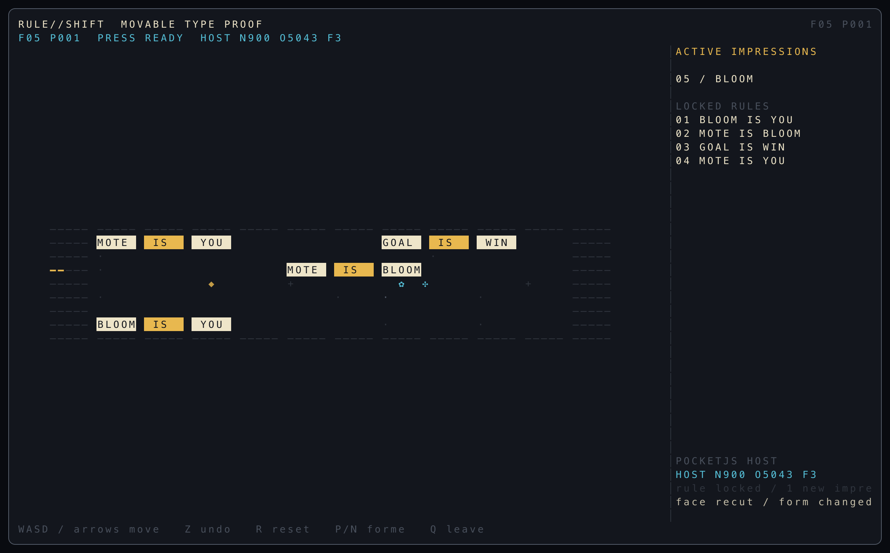

# RULE//SHIFT

**RULE//SHIFT** is a complete, turn-based rule puzzle and a second flagship
demo for the retained `@pocket-tui/pocketjs` backend. Nouns, links, and
properties are physical word blocks. Push them into valid sentences to change
which objects you control, which objects stop or push, and what completes the
stage.

The portable ANSI16 presentation is the complete game. Ghostty adds optional
truecolor letterpress bloom and semantic effects, but no rule, control, panel,
animation cue, or piece of information depends on a shader.

## Preview

These images are rendered from the real retained PocketJS `CanvasFrame`, not a
separate mock UI:





## Build and play

Build the workspace once from the repository root:

```sh
bun install
bun run build
```

Then run in the current terminal:

```sh
cd examples/rule-shift
bun run start
```

Or open a fresh Ghostty 1.3+ surface with the optional Syntax Loom pass:

```sh
bun run ghostty
```

The launcher changes no global Ghostty configuration. Its typed effect-bus
contract and precise cleanup behavior are documented in [`GHOSTTY.md`](GHOSTTY.md).

## Controls

- Arrow keys, WASD, or HJKL: move
- Z: undo one turn
- R: restart the current stage
- N / P: next / previous stage
- Q, Escape, or Ctrl-C: quit

Terminal text can arrive in batches. The entry adapter keeps at most eight
recognized actions, and the PocketJS session keeps the same bounded pulse
queue. RULE//SHIFT selects the backend's discrete queue policy
(`directionPulsePolicy: "queue"`), so every recognized direction remains an
ordered puzzle turn with its own Pocket press/release edge; overflow discards
the oldest pending action. Real-time applications retain the backend's default
`"latest"` policy, which coalesces stale direction repeats. Quit is consumed
before RULE//SHIFT's queue, so a buffered `q` still closes immediately.

Resizing recomputes only the presentation projection. It preserves the current
stage, turn, undo history, active rules, and entity positions. Wide terminals
show the proof sheet beside the board; compact terminals fold the same
information below it.

## The tutorial campaign

Five original stages teach the mechanics in deliberate layers:

1. **01 / KINDLE** — control, victory, and completing a sentence.
2. **02 / BREAKWATER** — breaking a `WALL IS STOP` clause.
3. **03 / FREIGHT** — moving a chain governed by `CRATE IS PUSH`.
4. **04 / TWIN CURRENT** — controlling two nouns at the same time.
5. **05 / BLOOM** — noun transformation and retained identity.

Every stage is deterministic and supports the same
undo/restart/level-navigation contract. The proof panel shows the rules that
are active *now*, while the trace reports exactly which clauses formed or
broke after a move.

This is a clean-room, mechanics-inspired project with original stage layouts,
names, copy, glyph art, palette, effects, and no audio. It does not include or
reproduce levels or assets from *Baba Is You*. The foundational idea of rules
as movable objects comes from Arvi “Hempuli” Teikari's excellent
[*Baba Is You*](https://www.hempuli.com/Baba/); please support the official game.

## What this proves about the backend

The application is mounted once and follows the real PocketJS 0.6 lifecycle:

```text
deterministic rule engine + immutable snapshot
        ↓ Solid signals / PocketJS onButtonPress + onFrame
fixed retained PocketJS text/view pools
        ↓ synchronous HostOps mutations
@pocket-tui/pocketjs cell layout + raster
        ↓ semantic CanvasFrame (backend-internal)
PocketTUI PTX1 → Rust row damage → terminal
```

Game and presentation modules do not import a Canvas, `CellBuffer`, or terminal
encoder, and emit no ANSI. Terminal-specific behavior is confined to the
generic PocketTUI surface selected by the entry point.

The demo exercises:

- A deterministic engine with simultaneous rule evaluation, push chains,
  `YOU`, `WIN`, `STOP`, `PUSH`, noun transformation, undo, restart, stage
  selection, and explicit semantic events.
- A pure presentation projection with a six-token ink/lead/paper/vermilion/
  cyan/brass system, layer-safe cell composition, timelines, wide/compact
  layouts, an active-rule proof, and a move trace.
- Stable retained node pools: 160 bed, 128 effect, 64 entity, and 96 panel
  runs. Updating or resizing a stage mutates these 448 text/style slots rather
  than remounting the component tree; overflow is shown as `HOST DROP` instead
  of allocating without a bound.
- Real PocketJS button edges and frame time, plus PocketTUI input, resize,
  cursor, optional typed effect bus, flush, and teardown behavior.

The reference backend still recomputes its active JS layout and bounded
semantic frame when dirty. Rust persistence limits terminal output to actual
row damage. See [`../../docs/pocketjs-backend.md`](../../docs/pocketjs-backend.md)
for the exact support and fallback boundary.

## Verification

Run the example's deterministic engine, presentation, and real-backend smoke
tests:

```sh
bun run test
```

The smoke test mounts the complete app through real PocketJS HostOps, drives
repeated and mixed input batches through the animation FIFO, walks all five
stages, resizes without losing game state, checks stable retained nodes, and
verifies surface close. From the repository root, `bun run test` includes this
suite alongside the TypeScript, PTX, native-core, terminal, and existing
PocketJS tests.
